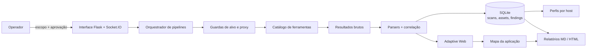

<div align="center">

# ReconX

### Orquestração visual, adaptativa e orientada por evidências para pentests autorizados

[](https://www.python.org/)
[](https://flask.palletsprojects.com/)
[](https://www.kali.org/)
[](#desenvolvimento-e-testes)
[](#uso-responsável)

**ReconX transforma ferramentas isoladas em um fluxo rastreável:** descobre a superfície,
preserva o escopo, seleciona testes compatíveis, correlaciona evidências e gera relatórios.

[Instalação](#instalação) · [Recursos](#o-que-o-reconx-faz) · [Arquitetura](#arquitetura) ·
[Pipelines](#pipelines) · [Documentação](#documentação)

</div>

---

## Visão geral

ReconX é uma interface web local para coordenar reconhecimento e testes de segurança. O projeto
combina um catálogo de ferramentas, execução em estágios, checkpoints pelo operador, perfis por host,
persistência SQLite e uma camada adaptativa para aplicações web.

Ele não trata saída de scanner como verdade automática. Findings começam como candidatos, são
deduplicados por causa-raiz e podem ser promovidos conforme a força da evidência — por exemplo,
execução real no navegador para confirmar XSS.

> [!IMPORTANT]
> ReconX é uma ferramenta de apoio. Autorizações, regras de engajamento e validação humana continuam
> obrigatórias. Uma execução concluída não comprova que o alvo está seguro.

## O que o ReconX faz

| Capacidade | Como funciona |
|---|---|
| **Pipelines de pentest** | Encadeia descoberta, fingerprint, enumeração e testes especializados. |
| **Adaptive Web** | Descobre páginas, formulários, parâmetros e requisições `fetch()` para selecionar testes GET/POST compatíveis. |
| **Engenharia reversa web** | Analisa HTML, scripts same-origin, bundles e source maps sem executar JavaScript arbitrário. |
| **Mapa arquitetural** | Correlaciona artefatos, métodos, endpoints REST/XHR, rotas, GraphQL, WebSocket/SSE e sinais de identidade/negócio. |
| **Contenção de escopo** | Preserva origem, porta e caminho-base; referências externas são inventariadas, não seguidas automaticamente. |
| **Evidência graduada** | Distingue `possible`, `likely`, `confirmed`, falso positivo, não reproduzido e lacuna de cobertura. |
| **Perfis por host** | Mantém histórico, serviços, findings, recomendações e checklist com referências de evidência. |
| **Proxy consistente** | Integra Burp Suite, OWASP ZAP, Tor ou proxy customizado, bloqueando fallback direto silencioso. |
| **Triagem por IA** | Fluxo opcional com catálogo fechado, contexto sanitizado e aprovação explícita por ação. |
| **Relatórios** | Exporta Markdown e HTML com cobertura, achados, evidências e mapa de engenharia reversa. |

## Arquitetura



### Fluxo de confiança

```text
output bruto → candidato → correlação/deduplicação → validação comportamental → finding confirmado
```

- Ferramentas de rede recebem hosts; ferramentas web recebem URLs completas.
- Redirects e pivôs para outra origem não ampliam autorização.
- Tool ausente, timeout, 404 ou parâmetro inexistente são estados de cobertura, não vulnerabilidades.
- Evidências brutas ficam separadas dos relatórios preparados.

## Pipelines

| Pipeline | Foco |
|---|---|
| **Recon inicial por host** | Portas, serviços e inventário persistente. |
| **Recon web segmentado** | Fingerprint HTTP, rotas e parâmetros após observar superfície web. |
| **Recon API segmentado** | Endpoints e parâmetros de APIs já observadas. |
| **Web App Pentest** | Reconhecimento e testes completos de aplicações web. |
| **API Pentest** | REST/GraphQL, CORS, parâmetros, secrets e injection. |
| **Full Pentest** | Recon, scan e camada de verificação manual. |
| **Subdomain Recon** | DNS, subdomínios, hosts vivos e takeover. |
| **Bug Bounty** | Cobertura ampla de superfície, conteúdo e vulnerabilidades. |
| **Cloud Attack Surface** | Certificados, exposição cloud, buckets e misconfigurações. |
| **Stealth Recon** | Reconhecimento de baixo ruído, sem brute force ativo. |
| **CTF / HTB Box** | Workflow concentrado para ambientes de laboratório. |
| **Triagem orientada por IA** | Black-box/white-box com aprovação por ação e executor restrito. |

Pipelines completos em perfil `full` incorporam o **Adaptive Web**. Também é possível montar um
pipeline customizado usando as ferramentas do catálogo.

## Engenharia reversa de aplicações web

A etapa adaptativa parte da URL completa fornecida pelo operador e mantém seu caminho-base durante a
descoberta. Sem executar código do alvo, o ReconX pode extrair:

- páginas, links, formulários, métodos, campos, tokens e query strings;
- requests literais `fetch()`/XHR e corpos construídos com `URLSearchParams`;
- scripts locais com tamanho, proveniência e SHA-256;
- frameworks e bundlers observados;
- endpoints REST/XHR, rotas frontend e operações GraphQL sintaticamente reconhecíveis;
- referências WebSocket/SSE e relações `artefato → operação → endpoint`;
- source maps e árvore de fontes, sem copiar `sourcesContent` para o relatório;
- sinais de autenticação, autorização, tenancy, identificadores e ações de negócio.

Scripts externos são registrados como dependências, mas não são acessados sem autorização própria.
Rotas calculadas em runtime, módulos dinâmicos, service workers, estado de SPA e áreas autenticadas
continuam sendo lacunas explícitas quando não há contexto para exercitá-las.

## Instalação

### Requisitos

- Kali Linux ou ambiente Debian compatível;
- Python 3 e Git;
- privilégios `sudo` para instalar em `/opt/reconx` e ferramentas opcionais;
- navegador moderno para a interface local.

### Instalação completa

```bash
git clone https://github.com/whx4mi/reconx.git
cd reconx
chmod +x install.sh
sudo ./install.sh
```

O instalador preserva resultados existentes por padrão e tenta instalar as ferramentas suportadas.
Entre as integrações opcionais, `jsluice` complementa a engenharia reversa de
JavaScript com análise AST de endpoints e parâmetros sem executar o código.
Para instalar somente a aplicação:

```bash
sudo ./install.sh --no-tools
```

> [!CAUTION]
> `sudo ./install.sh --purge-results` remove resultados anteriores. Use apenas quando essa exclusão
> for intencional e houver backup adequado.

## Executando

```bash
sudo reconx
```

Abra <http://127.0.0.1:5000>. O bind padrão é local. Para expor a interface deliberadamente na rede:

```bash
sudo reconx --expose
```

> [!WARNING]
> `--expose` usa `0.0.0.0`. Restrinja acesso com firewall/VPN e nunca exponha o diretório de
> resultados, que pode conter outputs sensíveis.

### Primeiro scan

1. Registre a autorização e informe o alvo com protocolo, porta e caminho completos.
2. Escolha um pipeline e um perfil de proxy.
3. Revise o impacto das etapas e inicie o scan.
4. Acompanhe checkpoints, ferramentas puladas e pendências de cobertura.
5. Valide candidatos antes de reportar e exporte o relatório do scan.

Exemplo de alvo com caminho preservado:

```text
https://lab.example:8443/aplicacao/
```

## Proxy

Perfis disponíveis na interface:

- **Direto** — sem proxy;
- **Burp Suite** — `http://127.0.0.1:8080`;
- **OWASP ZAP** — `http://127.0.0.1:8090`;
- **Tor** — SOCKS5/Privoxy local;
- **Customizado** — HTTP ou SOCKS5 definido pelo operador.

Se o proxy selecionado estiver inválido, inacessível ou incompatível com a ferramenta, a execução é
bloqueada. O ReconX não faz fallback silencioso para conexão direta.

## Resultados e relatórios

Por padrão, a instalação usa:

```text
/opt/reconx/
├── app/                         # runtime instalado
├── backups/                     # versões anteriores criadas pelo updater
└── results/
    ├── reconx.db                # scans, assets, findings e perfis
    ├── <scan_id>.json           # resultado consolidado
    ├── <host>/<scan_id>/        # outputs brutos por ferramenta
    └── .tmp/                    # temporários isolados do runtime
```

Endpoints úteis:

```text
GET /api/report/<scan_id>?fmt=md
GET /api/report/<scan_id>?fmt=html
GET /api/findings/<scan_id>
GET /api/scan/<scan_id>/summary
```

## Atualização recuperável

O updater valida a nova revisão antes da troca, preserva resultados e mantém backup para rollback:

```bash
sudo bash /opt/reconx/app/update.sh --check
sudo bash /opt/reconx/app/update.sh
```

Se o ReconX estiver rodando em primeiro plano, encerre-o com `Ctrl+C`, atualize e inicie novamente.

## IA opcional

A triagem por IA e a geração de wordlists usam Gemini somente quando configuradas. A chave fica no
ambiente da VM e não deve ser salva no repositório:

```bash
export GEMINI_MODEL="gemini-3.8-flash"
read -rsp 'Chave Gemini: ' GEMINI_API_KEY; echo
export GEMINI_API_KEY
sudo --preserve-env=GEMINI_API_KEY,GEMINI_MODEL reconx
```

O fluxo exige consentimento e aprovação por ação, mas a sanitização de contexto é heurística. Não
envie segredos ou dados de cliente ao provedor sem autorização específica.

## Desenvolvimento e testes

```bash
git clone https://github.com/whx4mi/reconx.git
cd reconx

python3 -m unittest discover -s tests -v
bash tests/test_update.sh
python3 -m py_compile app.py web_intelligence.py host_profiles.py
bash -n install.sh update.sh
git diff --check
```

A suíte atual possui **112 testes** e usa mocks/fixtures para evitar chamadas reais a alvos ou APIs
pagas durante a validação local.

## Documentação

- [Adaptive Web e engenharia reversa](ADAPTIVE_WEB.md)
- [Pipeline orientado por IA](AI_PIPELINE.md)
- [Perfis e histórico por host](HOST_PROFILES.md)
- [Análise técnica e referências](RECONX_ANALISE_REFERENCIAS.md)

## Uso responsável

Use o ReconX somente em ativos próprios ou com autorização explícita. Defina antes de executar:

- ativos, URLs e caminhos autorizados;
- identidades e papéis fornecidos;
- janela, taxa, concorrência e stop conditions;
- técnicas permitidas e operações excluídas;
- regras para dados sensíveis, evidências e retenção.

O operador é responsável por cumprir leis, contratos e regras do programa. Não use o projeto para
acesso não autorizado, indisponibilidade, persistência, exfiltração ou alteração destrutiva.

---

<div align="center">

**ReconX — cobertura útil, evidência rastreável e escopo sob controle.**

</div>
